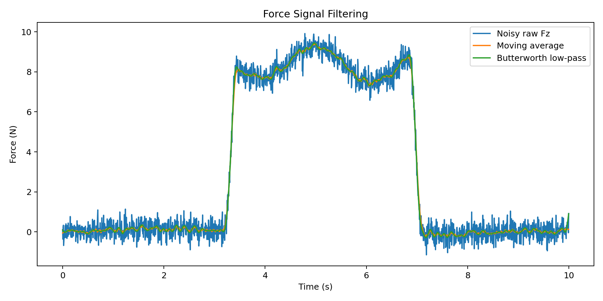
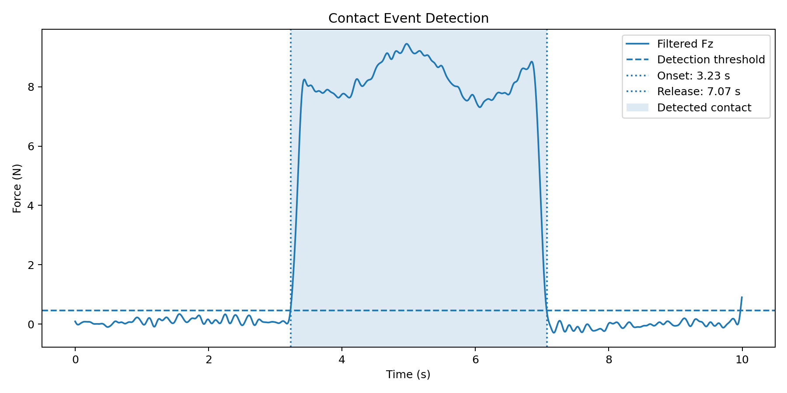
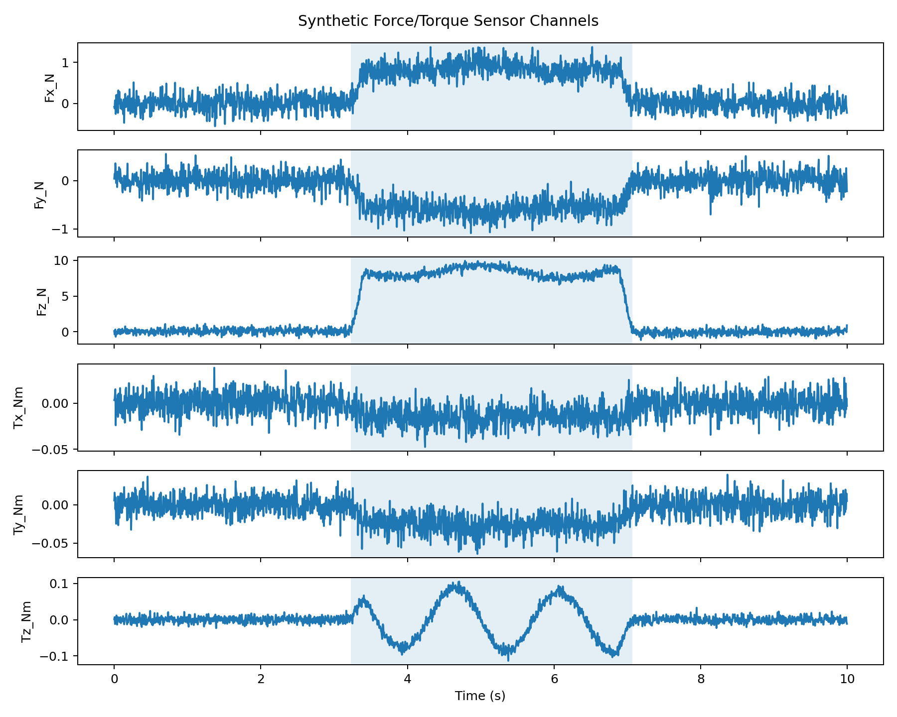

# Tactile/Force Signal Filtering and Contact Event Detection

A compact signal-processing project for force/torque-like tactile sensor data. The project generates synthetic force/torque measurements, filters a noisy normal-force signal, detects contact onset and release, extracts contact features, and saves plots and CSV outputs.

This project was built to demonstrate practical signal-processing skills relevant to sensor-based robotic manipulation, tactile perception, and robot control experiments.

## Project goals

- Generate synthetic force/torque-like data for a simple contact event.
- Add realistic measurement noise and low-frequency drift.
- Apply moving-average filtering and Butterworth low-pass filtering.
- Detect contact onset and release using an adaptive threshold from a baseline segment.
- Extract simple contact features such as peak force, mean force, contact duration, impulse, and rise time.
- Save reproducible plots and CSV files.

## Why this matters for robotics

Robotic manipulation often depends on noisy sensor measurements from force/torque sensors, tactile sensors, or estimated contact forces. Before these signals can be used for control, reinforcement learning, or contact-state estimation, they usually need filtering, event detection, and feature extraction.

This small project demonstrates a basic processing pipeline that can be extended to real force/torque sensors, tactile arrays, or visuotactile manipulation data.

## Method

The pipeline uses the following steps:

1. **Synthetic data generation**
   - Six channels are generated: `Fx`, `Fy`, `Fz`, `Tx`, `Ty`, and `Tz`.
   - The main contact event is represented in the normal-force channel `Fz`.
   - Gaussian noise and low-frequency drift are added.

2. **Filtering**
   - A centered moving-average filter is applied to reduce high-frequency noise.
   - A 4th-order Butterworth low-pass filter is applied with zero-phase filtering.

3. **Contact detection**
   - The first 1.5 seconds are used as the no-contact baseline.
   - A threshold is calculated as:

     ```text
     threshold = baseline_mean + 5 × baseline_standard_deviation
     ```

   - Contact onset is detected when the filtered force remains above the threshold for a minimum duration.
   - Contact release is detected when the filtered force returns below the threshold.

4. **Feature extraction**
   - Detected onset time
   - Detected release time
   - Contact duration
   - Peak raw force
   - Peak filtered force
   - Mean contact force
   - Force impulse
   - 10–90% rise time
   - Baseline mean and standard deviation

## Example results

For the default synthetic signal, the pipeline detects:

| Feature | Value |
|---|---:|
| Detected onset | 3.23 s |
| Detected release | 7.07 s |
| Contact duration | 3.84 s |
| Peak filtered force | 9.45 N |
| Mean contact force | 7.88 N |
| Force impulse | 30.24 N·s |
| Sampling frequency | 200 Hz |

## Plots

### Force signal filtering



### Contact event detection



### Synthetic force/torque channels



## Project structure

```text
tactile_force_contact_detection/
├── README.md
├── requirements.txt
├── src/
│   └── contact_detection.py
├── data/
│   └── synthetic_force_torque_data.csv
├── results/
│   └── contact_features_summary.csv
└── plots/
    ├── 01_force_signal_filtering.png
    ├── 02_contact_event_detection.png
    └── 03_force_torque_channels.png
```

## How to run

Clone the repository and install the dependencies:

```bash
git clone https://github.com/YOUR_USERNAME/tactile_force_contact_detection.git
cd tactile_force_contact_detection
python -m venv .venv
source .venv/bin/activate  # Linux/macOS
# .venv\\Scripts\\activate  # Windows PowerShell
pip install -r requirements.txt
python src/contact_detection.py
```

The script will regenerate the CSV outputs and plots.

## Dependencies

- Python 3.10+
- NumPy
- Pandas
- SciPy
- Matplotlib

## Possible extensions

- Replace synthetic data with real force/torque sensor logs.
- Add tactile-array data processing.
- Compare threshold-based detection with machine-learning-based contact classification.
- Add ROS 2 publishing/subscribing for real-time force-signal processing.
- Integrate contact features into a reinforcement-learning manipulation pipeline.

## CV description

**Tactile/Force Signal Filtering and Contact Event Detection** — Developed a Python signal-processing pipeline for synthetic force/torque-like tactile data, including noise modeling, moving-average and Butterworth low-pass filtering, adaptive contact onset/release detection, feature extraction, and visualization of contact dynamics.

## Note

The dataset in this repository is synthetic and intended for demonstrating signal-processing and contact-detection methods. It should not be interpreted as measurements from a calibrated physical force/torque sensor.
